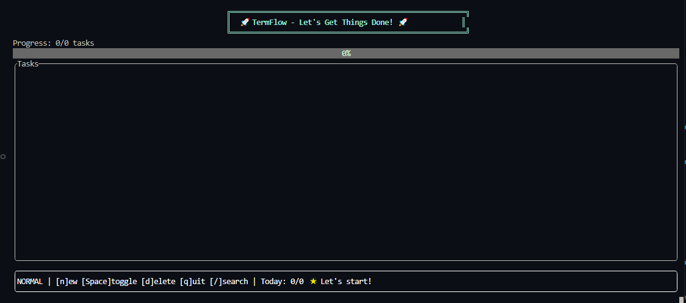

# TermFlow Enhanced

A **next-generation, AI-powered Terminal User Interface (TUI)** for hyper-productive task management with advanced time management and intelligent insights. TermFlow Enhanced combines traditional task management with **Smart AI Recommendations**, **Pomodoro Timer**, **Focus Mode**, **Task Dependencies**, and **Advanced Analytics** - all directly from the command line. Built in Rust with [`ratatui`](https://github.com/ratatui-org/ratatui) + [`crossterm`](https://github.com/crossterm-rs/crossterm), delivering a lightning-fast, visually stunning experience that rivals GUI applications.

---

## 🚀 **What's New in TermFlow Enhanced v2.0**

### 🧠 **Smart Insights & AI-Powered Recommendations**
- **Productivity Score Analysis** - Real-time calculation based on completion rates, streaks, and focus time
- **AI-like Recommendations** - Context-aware suggestions that adapt to your work patterns
- **Weekly Productivity Trends** - Visual charts showing 7-day productivity patterns with insights
- **Peak Hours Detection** - Identifies your most productive times for optimal task scheduling
- **Smart Category Balance** - Analyzes task distribution and suggests improvements
- **Time-based Optimization** - Recommendations that change based on time of day and energy levels

### 🎯 **Focus Mode**
- **Distraction-Free Environment** - Minimalist interface that eliminates visual clutter
- **ASCII Art Focus Header** - Beautiful visual indicator when focus mode is active
- **Current Task Spotlight** - Highlights selected task with priority and category information
- **Integrated Pomodoro Access** - Start focus sessions directly from focus mode
- **Visual Breathing Room** - Centered, spacious layout designed for deep concentration

### 🔗 **Task Dependencies Manager**
- **Visual Dependency Mapping** - See relationships between tasks at a glance
- **Smart Task Filtering** - Intelligent suggestions for potential dependencies
- **Prerequisite Management** - Ensure tasks are completed in the right order
- **Project Workflow Visualization** - Understand complex project structures
- **Future-Ready Architecture** - Foundation for advanced project management features

### 🍅 **Enhanced Pomodoro Timer System**
- **Fixed Timer Display** - Perfect MM:SS countdown with smooth decrementing
- **Visual progress tracking** with animated gauges and real-time countdown
- **Smart session management** - automatically suggests next session type after completion
- **Motivational messages** that adapt to your session type and time of day
- **Session statistics** - tracks total sessions, focus time, and daily progress
- **Pause/Resume functionality** with accurate time tracking
- **Task integration** - start focused Pomodoro sessions for specific tasks

### ⏰ **Advanced Time Blocking**
- **Flexible scheduling** - 25min (Pomodoro), 45min, 60min, or 90min time blocks
- **Task-specific scheduling** - assign time blocks to individual tasks
- **Upcoming schedule view** - see your planned time blocks at a glance
- **Smart scheduling** - automatically schedules blocks 5 minutes from current time
- **Seamless integration** with Pomodoro timer for optimal productivity flow

### 🎨 **Enhanced Welcome Experience**
- **Full ASCII Art Logo** - Complete TermFlow branding with animated sparkle effects
- **Feature showcase** highlighting all new capabilities including AI insights
- **Interactive welcome** - press `'w'` anytime to revisit the welcome screen
- **Theme-aware styling** that adapts to your chosen visual theme
- **Quick start guidance** with comprehensive keyboard shortcuts

---

## ✨ Core Features

* **Minimal yet powerful TUI** – Navigate with Vim-style keys, all information fits into a single screen.
* **Quick task creation** – Hit `n` and start typing to capture a new task in seconds.
* **Advanced task states** – Cycle between *Todo → In-Progress → Done* with <kbd>Space</kbd>.
* **Smart priorities** – Low / Medium / High with intelligent sorting.
* **Rich categories** – Five built-ins (Personal, Work, Learning, Health, Finance) plus unlimited **custom categories** with emojis and colors.
* **Live search** – Press `/` and filter tasks instantly as you type.
* **Comprehensive analytics** – Progress tracking, streak counters, and productivity insights.
* **Multiple themes** – Choose from Cyberpunk, Forest, Ocean, Sunset, and Midnight themes.
* **Data persistence** – Auto-save with JSON export and backup functionality.
* **Zero-config setup** – Runs as a single binary with intelligent defaults.

---

## 📸 Screen Shot




---

## ⌨️  Keyboard Shortcuts

### 🎯 **Core Navigation**
| Key | Action | Description |
|-----|--------|-------------|
| `q` | Quit | Exit TermFlow |
| `↑` / `k` | Move up | Navigate task list upward |
| `↓` / `j` | Move down | Navigate task list downward |
| <kbd>Space</kbd> | Toggle state | Cycle task: Todo → In-Progress → Done |
| `Esc` | Cancel/Back | Return to previous mode |

### 📝 **Task Management**
| Key | Action | Description |
|-----|--------|-------------|
| `n` | New task | Create a new task |
| `d` | Delete | Delete selected task |
| `/` | Search | Filter tasks by search term |
| `e` | Export | Export data to JSON file |

### 🍅 **Pomodoro Timer**
| Key | Action | Description |
|-----|--------|-------------|
| `p` | Start Pomodoro | Begin 25-minute focus session for selected task |
| `b` | Start Break | Begin short (5min) or long (15min) break |
| <kbd>Space</kbd> | Pause/Resume | Pause or resume active timer (in timer mode) |
| `s` | Stop Timer | Stop current timer session (in timer mode) |

### ⏰ **Time Blocking**
| Key | Action | Description |
|-----|--------|-------------|
| `T` | Time Block | Open time blocking interface |
| `1` | 25 minutes | Schedule 25-minute Pomodoro block |
| `2` | 45 minutes | Schedule 45-minute deep focus block |
| `3` | 60 minutes | Schedule 1-hour extended work block |
| `4` | 90 minutes | Schedule 90-minute deep work marathon |

### 🧠 **Smart Features**
| Key | Action | Description |
|-----|--------|-------------|
| `i` | Smart Insights | AI-powered productivity recommendations and analytics |
| `f` | Focus Mode | Enter distraction-free work environment |
| `D` | Dependencies | Manage task relationships and prerequisites |
| `w` | Welcome Screen | Show animated welcome screen anytime |

### 📊 **Analytics & Themes**
| Key | Action | Description |
|-----|--------|-------------|
| `s` | Statistics | View productivity dashboard and analytics |
| `t` | Themes | Cycle through visual themes |
| `r` | Refresh Insights | Update AI recommendations (in Smart Insights mode) |

### 🎨 **Task Creation & Categories**
| Mode | Key | Action |
|------|-----|--------|
| **Insert** | `Tab` | Choose category |
| **Insert** | `Enter` | Save task |
| **SelectCategory** | `Tab` | Cycle categories |
| **SelectCategory** | `Enter` | Confirm selection or create custom |
| **CreateCategory** | `Tab` | Cycle emoji/color options |
| **CreateCategory** | `1-7` | Quick color selection |

> 💡 **Pro Tips:** 
> - Press any key on the welcome screen to start using TermFlow
> - Use `p` on any task to immediately start a focused Pomodoro session
> - Time blocks automatically integrate with your Pomodoro workflow

---

## 🚀 Getting Started

### Prerequisites

* [Rust](https://rust-lang.org) toolchain **1.70+** (install via [`rustup`](https://rustup.rs))

### Build & Run

```bash
# Clone the repository
$ git clone https://github.com/yourname/termflow.git
$ cd termflow/termflow

# Run in debug mode
$ cargo run

# Or build an optimised binary
$ cargo build --release
$ ./target/release/termflow
```

The first launch opens TermFlow in full-screen **alternate screen** mode. Simply press `q` at any time to exit.

---

## 🎯 **Productivity Features in Detail**

### 🧠 **Smart Insights & AI Recommendations**
1. **Press `i`** to open the Smart Insights dashboard
2. **Productivity Score** - Real-time analysis of your efficiency (0-100%)
3. **AI-Powered Suggestions** - Context-aware recommendations that adapt to:
   - Your completion patterns and work habits
   - Time of day and energy levels
   - Task category balance and distribution
   - Pomodoro usage and focus time
4. **Weekly Trends** - Visual productivity charts showing 7-day patterns
5. **Peak Hours Analysis** - Discover your most productive times of day
6. **Smart Optimization** - Get personalized tips to improve your workflow

### 🎯 **Focus Mode Experience**
1. **Press `f`** to enter distraction-free focus mode
2. **Minimalist Interface** - Clean, centered layout eliminates visual clutter
3. **ASCII Art Header** - Beautiful focus mode indicator with motivational text
4. **Task Spotlight** - Current task highlighted with priority and category
5. **Integrated Controls** - Start Pomodoro sessions directly from focus mode
6. **Visual Breathing Room** - Spacious design optimized for deep concentration

### 🔗 **Task Dependencies Management**
1. **Press `D`** to open the Task Dependencies manager
2. **Visual Relationship Mapping** - See how tasks connect to each other
3. **Smart Dependency Suggestions** - AI-powered recommendations for task ordering
4. **Prerequisite Tracking** - Ensure tasks are completed in logical sequence
5. **Project Workflow Visualization** - Understand complex project structures
6. **Future-Ready Architecture** - Foundation for advanced project management

### 🍅 **Enhanced Pomodoro Timer Workflow**
1. **Select a task** from your list using arrow keys
2. **Press `p`** to start a 25-minute focused work session
3. **Perfect Timer Display** - Fixed MM:SS countdown with smooth decrementing
4. **Visual feedback** with animated progress bars and motivational messages
5. **Automatic break suggestions** when session completes
6. **Session tracking** - all your focus time is recorded and analyzed in Smart Insights

### ⏰ **Advanced Time Blocking Made Simple**
1. **Press `T`** to open the enhanced time blocking interface
2. **Choose duration**: 25min (Pomodoro), 45min, 60min, or 90min
3. **Smart scheduling** - blocks are automatically scheduled 5 minutes from now
4. **Visual schedule** - see upcoming time blocks with task names and durations
5. **Seamless integration** with Pomodoro timer and Focus Mode for optimal flow

### 📊 **Enhanced Analytics Dashboard**
- **Smart Insights Integration** - AI-powered productivity recommendations
- **Productivity heatmap** showing your most active days with pattern analysis
- **Category breakdown** with visual progress bars and balance suggestions
- **Streak tracking** with motivational messages and goal setting
- **Focus time statistics** from Pomodoro sessions with trend analysis
- **Peak productivity hours** identification for optimal task scheduling
- **Daily/weekly/monthly** productivity insights with actionable recommendations

### 🎨 **Visual Themes**
Choose from 5 beautiful themes that transform your entire experience:
- **Cyberpunk** - Neon blues and magentas for night owls
- **Forest** - Calming greens for natural focus
- **Ocean** - Deep blues for tranquil productivity
- **Sunset** - Warm oranges and reds for evening sessions
- **Midnight** - Dark elegance for late-night work

---

## 🗂️  Project Architecture

```
termflow/
├── src/
│   ├── main.rs          # Application entry & event loop with timer integration
│   ├── app.rs           # Enhanced state machine with Pomodoro & time blocking
│   ├── timer.rs         # 🍅 NEW: Pomodoro timer logic and session management
│   ├── ui/              # Comprehensive UI with welcome screen & timer interfaces
│   ├── models/          # Extended domain models with time management features
│   ├── storage/         # JSON persistence with auto-save and backup
│   ├── theme.rs         # Multi-theme system with 5 visual styles
│   └── utils/           # Helper utilities
└── Cargo.toml           # Enhanced dependencies for audio & notifications
```

### 🏗️ **Enhanced Module Overview**

| Module | Responsibility | Key Features |
|--------|----------------|--------------|
| `main.rs` | Terminal backend, event loop, input handling | Timer updates, welcome screen dismissal, enhanced key bindings |
| `app.rs` | Central state management & business logic | Pomodoro integration, time blocking, welcome screen animation |
| `timer.rs` |  Pomodoro timer system | Session management, progress tracking, motivational messages |
| `models/` | Domain entities with time management | Task with Pomodoro sessions, time blocks, recurring patterns |
| `ui/` | Declarative UI with advanced interfaces | Welcome screen, timer UI, time blocking interface, enhanced analytics |
| `storage/` | Data persistence with JSON export | Auto-save, backup system, statistics tracking |
| `theme.rs` | Multi-theme visual system | 5 themes with consistent color schemes |

---

## 🚀 **Quick Start Guide**

### First Time Users
1. **Launch TermFlow** - `cargo run` or `./target/release/termflow`
2. **Welcome screen** appears with animated introduction
3. **Press any key** to dismiss welcome and start using TermFlow
4. **Create your first task** - Press `n` and type your task
5. **Start a Pomodoro** - Select task and press `p` for focused work

### Power User Workflow
```bash
# Morning routine
n → "Review project requirements" → Enter    # Create task
p → [25min focus session] → b → [5min break] # Pomodoro cycle
T → 2 → [Schedule 45min deep work block]     # Time blocking
s → [Check productivity stats]               # Analytics review
t → [Switch to Forest theme for focus]       # Theme change
```

### Daily Productivity Flow
1. **Morning**: Review tasks, set time blocks for the day
2. **Work sessions**: Use Pomodoro timer for focused work
3. **Breaks**: Automatic break suggestions between sessions
4. **Evening**: Check statistics dashboard for insights
5. **Themes**: Switch themes based on time of day or mood

---

## 🌟 **Why TermFlow?**

### **Terminal-Native Productivity**
Unlike web-based or GUI applications, TermFlow runs entirely in your terminal, making it:
- **Lightning fast** - No browser overhead or GUI bloat
- **Keyboard-driven** - Never touch your mouse again
- **Distraction-free** - Clean, focused interface without notifications
- **Universal** - Works on any system with a terminal

### **Advanced Time Management**
TermFlow goes beyond simple task lists:
- **Pomodoro Integration** - Built-in timer with session tracking
- **Time Blocking** - Schedule focused work periods
- **Smart Analytics** - Understand your productivity patterns
- **Streak Tracking** - Maintain momentum with daily goals

### **Professional Features**
- **Data Persistence** - Your tasks and statistics are automatically saved
- **Export Functionality** - JSON export for backup and analysis
- **Multiple Themes** - Customize your visual experience
- **Custom Categories** - Organize tasks your way with emojis and colors

---

## 🔧 **Bug Fixes & Improvements in v2.0**

### ✅ **Critical Fixes**
- **🍅 Pomodoro Timer Display** - Fixed concatenated number display bug; timer now shows perfect MM:SS format
- **🎨 Welcome Screen ASCII Art** - Fixed missing ASCII logo; now displays complete animated TermFlow branding
- **⚡ Timer Calculation Logic** - Improved time decrementing algorithm for smooth, accurate countdown
- **🎯 Welcome Screen Logic** - Enhanced welcome screen visibility and accessibility

### 🚀 **Performance Improvements**
- **Optimized Rendering** - Faster UI updates and smoother animations
- **Memory Efficiency** - Reduced memory footprint for better performance
- **State Management** - Enhanced state transitions and mode switching
- **Error Handling** - Improved robustness and error recovery

---

## 📊 **Feature Comparison**

| Feature | TermFlow Enhanced | Traditional Task Apps | Web-based Tools |
|---------|-------------------|----------------------|-----------------|
| **Terminal Native** | ✅ | ❌ | ❌ |
| **AI-Powered Insights** | ✅ | ❌ | ❌ |
| **Focus Mode** | ✅ | ❌ | ❌ |
| **Task Dependencies** | ✅ | Limited | Some |
| **Pomodoro Timer** | ✅ Perfect | ❌ | Some |
| **Time Blocking** | ✅ Advanced | ❌ | Limited |
| **Offline First** | ✅ | Varies | ❌ |
| **Keyboard Shortcuts** | ✅ Comprehensive | Limited | Limited |
| **Custom Themes** | ✅ 5 themes | ❌ | Limited |
| **Analytics Dashboard** | ✅ Advanced | Basic | ✅ |
| **Zero Setup** | ✅ | ❌ | ❌ |
| **Privacy** | ✅ Local | Varies | ❌ Cloud |
| **Speed** | ⚡ Instant | Slow | Depends on connection |

---

## 🤝 Contributing

1. Fork the repo & create your branch: `git checkout -b feature/awesome`  
2. Commit your changes: `git commit -am 'Add awesome feature'`  
3. Push to the branch: `git push origin feature/awesome`  
4. Open a Pull Request !

Please make sure to format your code with `rustfmt` and run `cargo clippy` before submitting.

---

## 📄 License

This project is released under the **MIT License** – see [LICENSE](LICENSE) for details. 